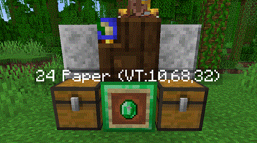

# Keen Trade

**Keen Trade** is a Spigot plugin that adds automatic trading with Villagers.

## Feature Roadmap

### Job Site Controller

Working name, may not need to be implemented. Would act as a central block (material yet to be determined) for attaching
Keen Trade structures.

### Trade Signal Block

A block (material yet to be determined) which when placed under an employed Villager's job site block, will output a
Redstone signal of strength *15* when the selected trade is at its maximum stock.

### Trading Station

*TODO: add better structure preview. ref Minecraft wiki structures. also image quality*

The **Trading Station** is a multi-block structure, built under an employed Villager's job site block. Trades can be
selected from the Villager's available trades by interacting with the *Display* Item Frame item, which will update its
name to reflect the current trade. Place items to be traded with the Villager in the *input* chest (e.g. paper or
emeralds). The **Trading Station** will automatically trade with the Villager, during its work hours, as if a player had
done the trades. When a trade is out of stock, the **Trading Station** will wait for the Villager to restock it. Any items
received from trading will be placed in the *output* chest.

#### Components

| Component | Block/Item      | Quantity | Note
| ---       | ---             | ---      | ---
| Base      | *Resource Block* (See *Base Material* table) | 1        | *Base Material* determines the capabilities of this *Trading Station*
| Input     | Chest           | 1        | Items to be traded with the Villager
| Output    | Chest           | 1        | Items received from trading with the Villager
| Display   | Item Frame      | 1        | Displays merchant/trade information
|           | Emerald         | 1        | renamed to "KT:TradingStation"

##### Base Material Table

| Base Material      | Trades/work day | Non-emerald trades | Multi-item trades
| ---                | ---             | ---                | ---
| Block of Iron      | 4               | No                 | No
| Block of Gold      | 8               | No                 | No
| Block of Emerald   | 16              | Yes                | No
| Block of Netherite | 32              | Yes                | Yes

Additional *Base Material* suggestions will be considered. *Base Material* suggestions should introduce new capability
to the *Trading Station*, and ideally be a resource storage block. An example would be adding a Copper *Base Material*,
which would introduce restricted hours during which it would allow the *Trading Station* to operate.